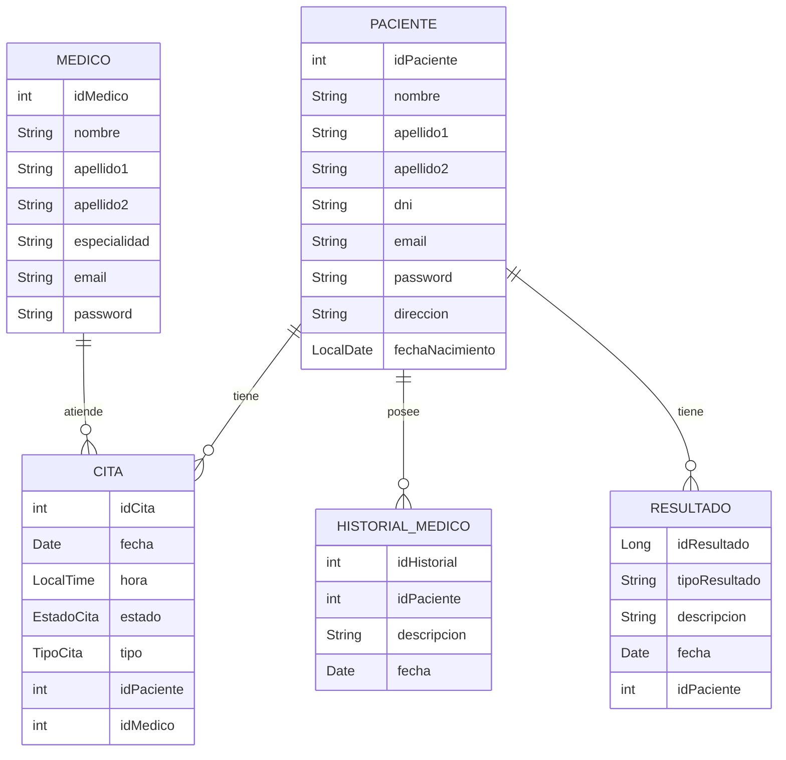

# Hospital Tramuntana System

## Introducción

El sistema Hospital Tramuntana es una aplicación diseñada para gestionar las operaciones diarias de un hospital que necesita un paciente. Proporciona funcionalidades para la gestión de citas, historiales médicos y resultados de pruebas. La aplicación está desarrollada en Java utilizando JPA (Jakarta Persistence API) para la persistencia de datos y Hibernate como proveedor de JPA.

## Características

- **Gestión de Pacientes**: Permite registrar, actualizar y consultar la información de los pacientes.
- **Gestión de Citas**: Permite programar, reprogramar y cancelar citas médicas.
- **Historial Médico**: Permite registrar y consultar el historial médico de los pacientes.
- **Resultados de Pruebas**: Permite registrar y consultar los resultados de las pruebas médicas de los pacientes.

## Diagrama Relacional

A continuación se presenta el diagrama relacional de las entidades principales del sistema:



## Requisitos
- **Java 17 o superior**
- **Maven 3.6.3 o superior**
- **Base de datos PostgreSQL**

## Recomendación
- **pgadmin4**

## Instalación
1. Clona el repositorio:
```shell
git clone https://github.com/tonijsb/hospital-tramuntana.git
```
2. Navega al directorio del proyecto:
```shell
cd hospital-tramuntana
```
3. Compila el proyecto usando Maven:
```shell
mvn clean install
```
Uso
Configura la ruta de acceso a la base de datos en el [fichero de configuración de hibernate](src/main/resources/hibernate.cfg.xml), en el fichero [Constants](src/main/java/org/example/Constants.java) la variable "PDF_PATH" especifica donde almacenar los documentos PDF. Recomendamos cambiarlo a la ruta de descargas o al escritorio del equipo en el que se vaya a ejecutar. 
**En caso de no modificarlo no impedirá su uso.**

### Licencia

**Este proyecto no tiene licencia dado que es un proecto de final de trimestre en la academia CESUR, cursando Desarrollo de aplicaiones multiplataforma.**