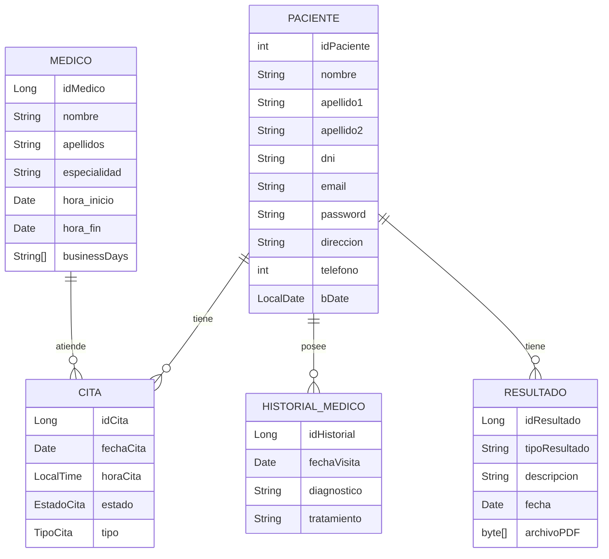

```mermaid
erDiagram
    PACIENTE {
        int idPaciente
        String nombre
        String apellido1
        String apellido2
        String dni
        String email
        String password
        String direccion
        int telefono
        LocalDate bDate
    }

    MEDICO {
        Long idMedico
        String nombre
        String apellidos
        String especialidad
        Date hora_inicio
        Date hora_fin
        String[] businessDays
    }

    CITA {
        Long idCita
        Date fechaCita
        LocalTime horaCita
        EstadoCita estado
        TipoCita tipo
    }

    HISTORIAL_MEDICO {
        Long idHistorial
        Date fechaVisita
        String diagnostico
        String tratamiento
    }

    RESULTADO {
        Long idResultado
        String tipoResultado
        String descripcion
        Date fecha
        byte[] archivoPDF
    }

    PACIENTE ||--o{ CITA : "tiene"
    MEDICO ||--o{ CITA : "atiende"
    PACIENTE ||--o{ HISTORIAL_MEDICO : "posee"
    PACIENTE ||--o{ RESULTADO : "tiene"
```